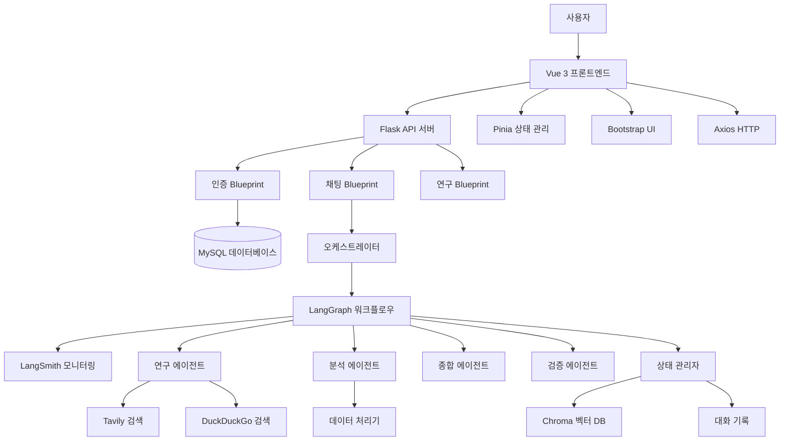
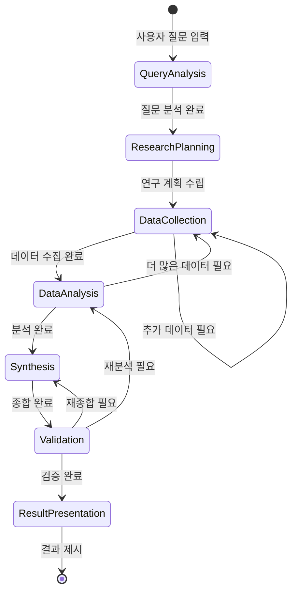

# 설계 문서 (Design Document)

## 개요 (Overview)

Deep Research Chatbot은 LangChain과 LangGraph를 활용한 멀티 에이전트 시스템으로, 사용자의 질문에 대해 심층적이고 포괄적인 연구를 수행합니다. 시스템은 여러 전문 에이전트가 협력하여 정보를 수집, 분석, 종합하는 구조로 설계되며, 상태 기반 워크플로우를 통해 체계적인 연구 프로세스를 관리합니다.

## 아키텍처 (Architecture)

### 전체 시스템 아키텍처



### 레이어 구조

1. **프레젠테이션 레이어**: Vue 3 + Pinia + Bootstrap 기반 사용자 인터페이스
2. **API 레이어**: Flask Blueprint 기반 REST API
3. **인증 레이어**: JWT 기반 사용자 인증 및 권한 관리
4. **오케스트레이션 레이어**: 워크플로우 관리 및 에이전트 조정
5. **에이전트 레이어**: 전문화된 AI 에이전트들
6. **도구 레이어**: 외부 API, 검색 엔진, 데이터베이스 연결
7. **데이터 레이어**: MySQL, Chroma, 메모리, 대화 기록 저장

## 컴포넌트 및 인터페이스 (Components and Interfaces)

### 1. 핵심 에이전트들

#### ResearchAgent (연구 에이전트)
- **역할**: 초기 정보 수집 및 기본 연구 수행
- **기능**: 
  - 웹 검색을 통한 정보 수집
  - 학술 데이터베이스 쿼리
  - 소스 신뢰성 평가
- **입력**: 연구 주제, 검색 키워드
- **출력**: 구조화된 연구 데이터, 소스 목록

#### AnalysisAgent (분석 에이전트)
- **역할**: 수집된 정보의 심층 분석
- **기능**:
  - 데이터 패턴 분석
  - 상관관계 발견
  - 통계적 분석
- **입력**: 연구 데이터, 분석 요구사항
- **출력**: 분석 결과, 인사이트

#### SynthesisAgent (종합 에이전트)
- **역할**: 분석 결과를 종합하여 최종 답변 생성
- **기능**:
  - 정보 통합 및 요약
  - 논리적 구조화
  - 사용자 친화적 형태로 변환
- **입력**: 분석 결과, 사용자 질문
- **출력**: 최종 연구 보고서

#### ValidationAgent (검증 에이전트)
- **역할**: 결과의 정확성 및 일관성 검증
- **기능**:
  - 팩트 체킹
  - 논리적 일관성 검사
  - 품질 평가
- **입력**: 종합된 결과
- **출력**: 검증 보고서, 개선 제안

### 2. 워크플로우 관리자

#### LangGraphOrchestrator
```python
class LangGraphOrchestrator:
    def __init__(self):
        self.workflow = self._build_workflow()
        self.state_manager = StateManager()
    
    def _build_workflow(self) -> StateGraph:
        # 워크플로우 그래프 구성
        pass
    
    def execute_research(self, query: str) -> ResearchResult:
        # 연구 워크플로우 실행
        pass
```

#### StateManager
```python
class StateManager:
    def __init__(self):
        self.current_state = ResearchState()
        self.history = []
    
    def update_state(self, new_data: dict):
        # 상태 업데이트
        pass
    
    def get_context(self) -> dict:
        # 현재 컨텍스트 반환
        pass
```

### 3. 사용자 인증 및 관리 시스템

#### AuthService (인증 서비스)
```python
class AuthService:
    def __init__(self):
        self.jwt_manager = JWTManager()
        self.user_repository = UserRepository()
    
    def register(self, user_data: UserRegistration) -> User:
        # 사용자 등록 처리
        pass
    
    def authenticate(self, username: str, password: str) -> AuthResult:
        # 사용자 인증 처리
        pass
    
    def refresh_token(self, refresh_token: str) -> str:
        # 토큰 갱신
        pass
```

#### UserRepository (사용자 저장소)
```python
class UserRepository:
    def __init__(self):
        self.db = MySQLDatabase()
    
    def create_user(self, user: User) -> User:
        # 사용자 생성
        pass
    
    def get_user_by_id(self, user_id: str) -> Optional[User]:
        # ID로 사용자 조회
        pass
    
    def get_user_by_username(self, username: str) -> Optional[User]:
        # 사용자명으로 조회
        pass
```

### 4. 대화 관리 시스템

#### ConversationManager (대화 관리자)
```python
class ConversationManager:
    def __init__(self):
        self.conversation_store = ConversationStore()
    
    def save_conversation(self, session_id: str, message: ConversationMessage):
        # 대화 메시지 저장
        pass
    
    def get_conversation_history(self, session_id: str) -> List[ConversationMessage]:
        # 대화 기록 조회
        pass
    
    def create_new_session(self) -> str:
        # 새로운 대화 세션 생성
        pass
```

### 4. 도구 및 유틸리티

#### SearchTool
- 웹 검색 API 연동 (Google Search, Bing API)
- 학술 검색 (arXiv, PubMed API)
- 뉴스 검색 (News API)

#### VectorDatabase (벡터 데이터베이스)
```python
class VectorDatabase:
    def __init__(self):
        self.vector_store = ChromaDB()  # 또는 FAISS
        self.embeddings = OpenAIEmbeddings()
    
    def store_document(self, document: str, metadata: dict) -> str:
        # 문서를 벡터화하여 저장
        pass
    
    def similarity_search(self, query: str, k: int = 5) -> List[Document]:
        # 유사성 기반 문서 검색
        pass
    
    def search_research_history(self, query: str) -> List[ResearchData]:
        # 이전 연구 결과에서 유사한 내용 검색
        pass
```

#### DataProcessor
- 텍스트 전처리 및 정제
- 구조화된 데이터 추출
- 중복 제거 및 데이터 정규화
- 문서 청킹 및 임베딩 생성

## 데이터 모델 (Data Models)

### ResearchState
```python
@dataclass
class ResearchState:
    query: str
    current_step: str
    collected_data: List[ResearchData]
    analysis_results: List[AnalysisResult]
    synthesis_result: Optional[SynthesisResult]
    validation_status: ValidationStatus
    metadata: dict
```

### ResearchData
```python
@dataclass
class ResearchData:
    source: str
    content: str
    reliability_score: float
    timestamp: datetime
    tags: List[str]
    raw_data: dict
```

### AnalysisResult
```python
@dataclass
class AnalysisResult:
    analysis_type: str
    findings: List[str]
    confidence_score: float
    supporting_data: List[ResearchData]
    insights: List[str] <!-- 용자가 행동하거나 결정을 내리는 데 도움이 되는 핵심 인사이트 -->
```

### SynthesisResult
```python
@dataclass
class SynthesisResult:
    summary: str
    key_points: List[str]
    conclusions: List[str]
    recommendations: List[str]
    sources: List[str]
    confidence_level: float
```

### 사용자 관련 데이터 모델

#### User
```python
@dataclass
class User:
    id: str
    username: str
    email: str
    password_hash: str
    created_at: datetime
    last_login: Optional[datetime]
    is_active: bool = True
```

#### UserRegistration
```python
@dataclass
class UserRegistration:
    username: str
    email: str
    password: str
```

#### AuthResult
```python
@dataclass
class AuthResult:
    success: bool
    user: Optional[User]
    access_token: Optional[str]
    refresh_token: Optional[str]
    message: str
```

### 대화 관련 데이터 모델

#### ConversationMessage
```python
@dataclass
class ConversationMessage:
    id: str
    session_id: str
    user_id: Optional[str]
    role: str  # user, assistant, system
    content: str
    timestamp: datetime
    metadata: dict = None
```

#### ConversationSession
```python
@dataclass
class ConversationSession:
    id: str
    user_id: Optional[str]
    created_at: datetime
    last_activity: datetime
    messages: List[ConversationMessage]
    status: str  # active, completed
```

## 워크플로우 설계

### 연구 프로세스 플로우



### 에이전트 협력 패턴

1. **순차적 처리**: 연구 → 분석 → 종합 → 검증
2. **병렬 처리**: 여러 연구 에이전트가 동시에 다른 소스 탐색
3. **피드백 루프**: 검증 에이전트의 피드백에 따른 재처리
4. **동적 라우팅**: 질문 유형에 따른 적절한 에이전트 선택

## 오류 처리 (Error Handling)

### 에이전트 레벨 오류 처리
- **타임아웃 처리**: 각 에이전트별 최대 실행 시간 설정
- **재시도 메커니즘**: 실패한 작업에 대한 자동 재시도
- **대체 전략**: 주요 도구 실패 시 대안 도구 사용

### 시스템 레벨 오류 처리
- **상태 복구**: 중간 실패 시 이전 상태로 복구
- **부분 결과 활용**: 완전한 연구가 불가능할 때 부분 결과 제공
- **사용자 알림**: 오류 상황에 대한 명확한 사용자 피드백

### 오류 유형별 대응
```python
class ErrorHandler:
    def handle_api_error(self, error: APIError):
        # API 오류 처리 (대체 API 사용)
        pass
    
    def handle_timeout_error(self, error: TimeoutError):
        # 타임아웃 오류 처리 (부분 결과 반환)
        pass
    
    def handle_validation_error(self, error: ValidationError):
        # 검증 오류 처리 (재연구 요청)
        pass
```

## 테스트 전략 (Testing Strategy)

### 단위 테스트
- **에이전트 테스트**: 각 에이전트의 개별 기능 테스트
- **도구 테스트**: 외부 API 연동 및 데이터 처리 테스트
- **상태 관리 테스트**: 상태 전환 및 데이터 일관성 테스트

### 통합 테스트
- **워크플로우 테스트**: 전체 연구 프로세스 통합 테스트
- **에이전트 협력 테스트**: 에이전트 간 통신 및 협력 테스트
- **성능 테스트**: 대용량 데이터 처리 및 응답 시간 테스트

### 시나리오 테스트
```python
class ResearchScenarioTests:
    def test_simple_factual_query(self):
        # 단순 사실 질문에 대한 연구 테스트
        pass
    
    def test_complex_analytical_query(self):
        # 복잡한 분석 질문에 대한 연구 테스트
        pass
    
    def test_multi_domain_query(self):
        # 여러 도메인에 걸친 질문 테스트
        pass
```

### 품질 보증
- **결과 정확성 검증**: 알려진 답변과의 비교 테스트
- **소스 신뢰성 검증**: 인용된 소스의 신뢰성 평가
- **응답 시간 모니터링**: 사용자 경험을 위한 성능 기준 설정

## 확장성 고려사항

### 에이전트 확장
- **플러그인 아키텍처**: 새로운 전문 에이전트 쉽게 추가
- **설정 기반 에이전트**: YAML/JSON 설정으로 에이전트 동작 정의
- **동적 로딩**: 런타임에 에이전트 추가/제거

### 도구 확장
- **도구 레지스트리**: 사용 가능한 도구들의 중앙 관리
- **API 어댑터**: 새로운 외부 서비스 쉽게 통합
- **커스텀 도구**: 사용자 정의 도구 개발 지원

### 성능 최적화
- **캐싱 전략**: 자주 사용되는 연구 결과 캐싱
- **병렬 처리**: 독립적인 작업의 동시 실행
- **리소스 관리**: 메모리 및 CPU 사용량 최적화