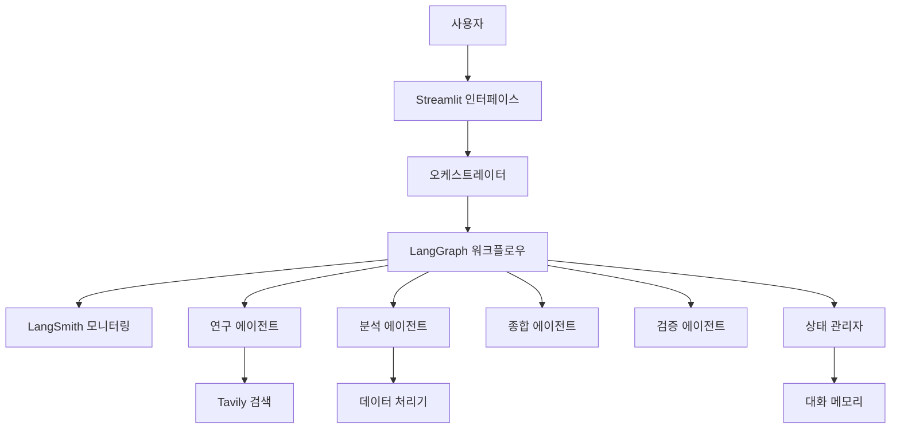
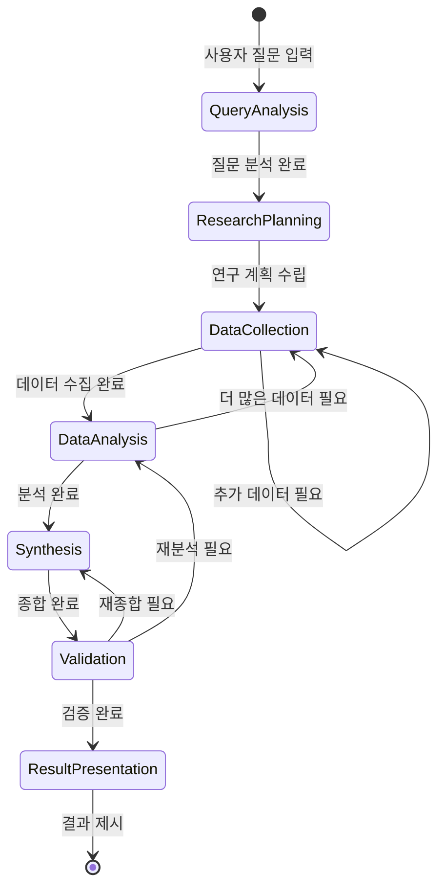

# 설계 문서 (Design Document)

## 개요 (Overview)

Deep Research Chatbot은 LangChain과 LangGraph를 활용한 멀티 에이전트 시스템으로, 사용자의 질문에 대해 심층적이고 포괄적인 연구를 수행합니다. 시스템은 여러 전문 에이전트가 협력하여 정보를 수집, 분석, 종합하는 구조로 설계되며, 상태 기반 워크플로우를 통해 체계적인 연구 프로세스를 관리합니다. Streamlit을 통한 최소한의 사용자 인터페이스를 제공합니다.

## 아키텍처 (Architecture)

### 전체 시스템 아키텍처



### 레이어 구조

1. **프레젠테이션 레이어**: Streamlit 기반 최소 사용자 인터페이스
2. **오케스트레이션 레이어**: 워크플로우 관리 및 에이전트 조정
3. **에이전트 레이어**: 전문화된 AI 에이전트들
4. **도구 레이어**: Tavily API 검색 연결
5. **데이터 레이어**: 메모리 기반 대화 기록 저장

## 컴포넌트 및 인터페이스 (Components and Interfaces)

### 1. 핵심 에이전트들

#### ResearchAgent (연구 에이전트)
- **역할**: 초기 정보 수집 및 기본 연구 수행
- **기능**: 
  - Tavily API를 통한 웹 검색
  - 소스 신뢰성 평가
  - 정보 구조화
- **입력**: 연구 주제, 검색 키워드
- **출력**: 구조화된 연구 데이터, 소스 목록

#### AnalysisAgent (분석 에이전트)
- **역할**: 수집된 정보의 심층 분석
- **기능**:
  - 데이터 패턴 분석
  - 상관관계 발견
  - 통계적 분석
- **입력**: 연구 데이터, 분석 요구사항
- **출력**: 분석 결과, 인사이트

#### SynthesisAgent (종합 에이전트)
- **역할**: 분석 결과를 종합하여 최종 답변 생성
- **기능**:
  - 정보 통합 및 요약
  - 논리적 구조화
  - 사용자 친화적 형태로 변환
- **입력**: 분석 결과, 사용자 질문
- **출력**: 최종 연구 보고서

#### ValidationAgent (검증 에이전트)
- **역할**: 결과의 정확성 및 일관성 검증
- **기능**:
  - 팩트 체킹
  - 논리적 일관성 검사
  - 품질 평가
- **입력**: 종합된 결과
- **출력**: 검증 보고서, 개선 제안

### 2. 워크플로우 관리자

#### LangGraphOrchestrator
```python
class LangGraphOrchestrator:
    def __init__(self):
        self.workflow = self._build_workflow()
        self.state_manager = StateManager()
    
    def _build_workflow(self) -> StateGraph:
        # 워크플로우 그래프 구성
        pass
    
    def execute_research(self, query: str) -> ResearchResult:
        # 연구 워크플로우 실행
        pass
```

#### StateManager
```python
class StateManager:
    def __init__(self):
        self.current_state = ResearchState()
        self.history = []
    
    def update_state(self, new_data: dict):
        # 상태 업데이트
        pass
    
    def get_context(self) -> dict:
        # 현재 컨텍스트 반환
        pass
```

### 3. Streamlit 인터페이스

#### StreamlitApp
```python
class StreamlitApp:
    def __init__(self):
        self.orchestrator = LangGraphOrchestrator()
        self.conversation_memory = ConversationMemory()
    
    def render_interface(self):
        # Streamlit UI 컴포넌트 렌더링
        pass
    
    def handle_user_input(self, query: str):
        # 사용자 입력 처리 및 연구 실행
        pass
    
    def display_results(self, results: ResearchResult):
        # 연구 결과 표시
        pass
```

### 4. 대화 관리 시스템

#### ConversationMemory (대화 메모리)
```python
class ConversationMemory:
    def __init__(self):
        self.messages = []
        self.context_window = 10  # 최근 10개 메시지만 컨텍스트로 유지
    
    def add_message(self, role: str, content: str):
        # 메시지 추가
        pass
    
    def get_context(self) -> List[dict]:
        # 대화 컨텍스트 반환
        pass
    
    def clear_memory(self):
        # 메모리 초기화
        pass
```

### 5. 도구 및 유틸리티

#### TavilySearchTool
```python
class TavilySearchTool:
    def __init__(self):
        self.api_key = os.getenv("TAVILY_API_KEY")
        self.client = TavilyClient(api_key=self.api_key)
    
    def search(self, query: str, max_results: int = 5) -> List[SearchResult]:
        # Tavily API를 사용한 검색
        pass
    
    def search_with_context(self, query: str, context: str) -> List[SearchResult]:
        # 컨텍스트를 포함한 검색
        pass
```

#### DataProcessor
- 텍스트 전처리 및 정제
- 구조화된 데이터 추출
- 중복 제거 및 데이터 정규화

## 데이터 모델 (Data Models)

### ResearchState
```python
@dataclass
class ResearchState:
    query: str
    current_step: str
    collected_data: List[ResearchData]
    analysis_results: List[AnalysisResult]
    synthesis_result: Optional[SynthesisResult]
    validation_status: ValidationStatus
    metadata: dict
```

### ResearchData
```python
@dataclass
class ResearchData:
    source: str
    content: str
    reliability_score: float
    timestamp: datetime
    tags: List[str]
    raw_data: dict
```

### AnalysisResult
```python
@dataclass
class AnalysisResult:
    analysis_type: str
    findings: List[str]
    confidence_score: float
    supporting_data: List[ResearchData]
    insights: List[str]
```

### SynthesisResult
```python
@dataclass
class SynthesisResult:
    summary: str
    key_points: List[str]
    conclusions: List[str]
    recommendations: List[str]
    sources: List[str]
    confidence_level: float
```

### SearchResult
```python
@dataclass
class SearchResult:
    title: str
    url: str
    content: str
    score: float
    published_date: Optional[datetime]
```

### ConversationMessage
```python
@dataclass
class ConversationMessage:
    role: str  # user, assistant, system
    content: str
    timestamp: datetime
    metadata: Optional[dict] = None
```

## 워크플로우 설계

### 연구 프로세스 플로우



### 에이전트 협력 패턴

1. **순차적 처리**: 연구 → 분석 → 종합 → 검증
2. **병렬 처리**: 여러 연구 에이전트가 동시에 다른 관점 탐색
3. **피드백 루프**: 검증 에이전트의 피드백에 따른 재처리
4. **동적 라우팅**: 질문 유형에 따른 적절한 에이전트 선택

## 오류 처리 (Error Handling)

### 에이전트 레벨 오류 처리
- **타임아웃 처리**: 각 에이전트별 최대 실행 시간 설정
- **재시도 메커니즘**: 실패한 작업에 대한 자동 재시도
- **우아한 실패**: 부분 실패 시에도 가용한 결과 제공

### 시스템 레벨 오류 처리
- **상태 복구**: 중간 실패 시 이전 상태로 복구
- **부분 결과 활용**: 완전한 연구가 불가능할 때 부분 결과 제공
- **사용자 알림**: 오류 상황에 대한 명확한 사용자 피드백

### 오류 유형별 대응
```python
class ErrorHandler:
    def handle_api_error(self, error: APIError):
        # API 오류 처리 (재시도 또는 부분 결과 제공)
        pass
    
    def handle_timeout_error(self, error: TimeoutError):
        # 타임아웃 오류 처리 (부분 결과 반환)
        pass
    
    def handle_validation_error(self, error: ValidationError):
        # 검증 오류 처리 (재연구 요청)
        pass
```

## 테스트 전략 (Testing Strategy)

### 단위 테스트
- **에이전트 테스트**: 각 에이전트의 개별 기능 테스트
- **도구 테스트**: Tavily API 연동 테스트
- **상태 관리 테스트**: 상태 전환 및 데이터 일관성 테스트

### 통합 테스트
- **워크플로우 테스트**: 전체 연구 프로세스 통합 테스트
- **에이전트 협력 테스트**: 에이전트 간 통신 및 협력 테스트
- **성능 테스트**: 응답 시간 및 처리량 테스트

### 시나리오 테스트
```python
class ResearchScenarioTests:
    def test_simple_factual_query(self):
        # 단순 사실 질문에 대한 연구 테스트
        pass
    
    def test_complex_analytical_query(self):
        # 복잡한 분석 질문에 대한 연구 테스트
        pass
    
    def test_multi_domain_query(self):
        # 여러 도메인에 걸친 질문 테스트
        pass
```

## 확장성 고려사항

### 에이전트 확장
- **플러그인 아키텍처**: 새로운 전문 에이전트 쉽게 추가
- **설정 기반 에이전트**: YAML/JSON 설정으로 에이전트 동작 정의
- **동적 로딩**: 런타임에 에이전트 추가/제거

### 도구 확장
- **도구 레지스트리**: 사용 가능한 도구들의 중앙 관리
- **API 어댑터**: 새로운 검색 서비스 쉽게 통합
- **커스텀 도구**: 사용자 정의 도구 개발 지원

### 성능 최적화
- **응답 스트리밍**: Streamlit을 통한 실시간 결과 스트리밍
- **병렬 처리**: 독립적인 작업의 동시 실행
- **메모리 관리**: 대화 컨텍스트 크기 제한으로 메모리 최적화